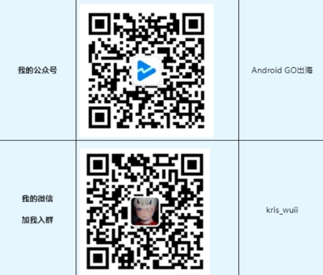

## 这里是一个专门收集出海相关的网址书签库

大家好，我是牢鹅！作为一位出海十年老兵，在工作中积攒了很多出海相关的实用网址，希望分享出来提高大家的工作效率。

这些网址涵盖多种功能用途：申诉表单、政策更新、资源申请、学习社区以及各类开发文档相关或常用查询工具等等领域。

不求面面俱到，只求无私分享！**出海开发必备，本库将会持续更新，强烈建议收藏点个Star！**

[谷歌封号下架数据收集库传送门](https://github.com/AndroidGODev/Bad-Google-Play)

[出海赚刀乐！39个谷歌开发者必备网址分享](https://mp.weixin.qq.com/s/NQV36fp2kX3DADhfVMcvjQ)

#### 关于我：

本开源库的网址将按照公众号发布的顺序排列，大家可以根据对应模块跳转阅读。

#### 第一期（Google相关）

- [开发者常用申诉表单（工单）](#unit1_1)
- [谷歌相关常用网址（使用率99.99%）](#unit1_2)
- [SDK接入文档](#unit1_3)
- [谷歌政策与查询工具](#unit1_4)
- [谷歌资讯与学习社区](#unit1_5)

#### 第二期（开发文档相关）

- [广告平台相关](#unit2_1)
- [登录相关](#unit2_2)
- [支付相关](#unit2_3)
- [归因统计相关](#unit2_4)

**开发者常用申诉表单（工单）**

1. 谷歌开发者账号封号申诉

   https://support.google.com/googleplay/android-developer/troubleshooter/2993242

   - 此表单可以联系 Google Play 咨询账号终止、应用删除或暂停事宜。

2. 应用发布常见问题（催审）

   https://support.google.com/googleplay/android-developer/contact/publishing?sjid=12254154666482743381-NA

   - 遇到与 Google Play 开发者账号有关的应用发布问题，需要相关帮助请填写下面的表单。比如：催审、删除应用、预注册！

3. 开发者账号身份验证申诉

   https://support.google.com/googleplay/android-developer/contact/idv_form?hl=en&sjid=78641367597158053-NA

   - 主要就是针对身份验证失败的开发者，填写对应表单内容，向谷歌阐述无法验证通过的理由，请注意，这里有提到申诉的内容只能使用英语填写。

4. Google Adsense PIN码邮寄问题

   https://support.google.com/admob/contact/mail_pin_issues

   - 一直收不到PIN码，请填写此表单。请务必输入所有必填信息并附上你的身份证明，以便谷歌验证您的 AdMob 账号中登记的邮政地址是否真实有效。

5. 谷歌商店精品推荐申请

   https://support.google.com/googleplay/contact/featuring_review

   - 如果你的应用或者游戏打算被谷歌推荐到这个板块，那你可以尝试填写这个申请表单。

6. 版权申诉：第三方知识产权内容

   https://support.google.com/googleplay/android-developer/contact/adv_note

   - 在没有经过预先提交版权文件的情况下使用第三方内容，以及假冒版权使用第三方内容被发现，用第三方内容二创后被举报等。这里有一个小提示，如果你的app已经拿到了第三方授权，请在提包之前先提交授权文件到此表单。

7. 更新付款资料信息申请表单

   https://support.google.com/googlepay/contact/change_name_address

   - 如果你属于以下情况，请填写此表单：
     - 需要更新付款资料中的名字，但由于之前已完成名字验证流程，该信息呈灰显状态（锁定）。
     - 需要上传文件来验证你的 Dun & Bradstreet 公司资料中的信息。

8. 向谷歌提交review应用更多信息

   https://support.google.com/googleplay/android-developer/contact/play_information_request

   - 开发者向谷歌商店提交应用，谷歌在审核阶段会被要求提供更多关于应用的相关信息：应用核心功能、用户数据、第三方代码和 SDK纰漏等。帮助谷歌审核你的应用，加快审核进程。

**谷歌相关常用网址（使用率99.99%）**

1. 谷歌开发者支持

   https://support.google.com/googleplay/android-developer/answer/7218994?hl=zh-Hans

   - 开发者可通过该地址向谷歌寻求在使用 Google Play Console 的过程中遇到的账号，付款，平台bug、报错等问题等相关问题的帮助，目前只支持回复以英语、中文、日语或韩语发送的电子邮件。

2. Play帮助中心

   https://support.google.com/googleplay/android-developer#topic=3450769

   - 开发者遇到的问题时，可根据关键字搜索为你匹配对应的帮助文档。

3. 查看Google Play付款资料

   https://payments.google.com/gp/w/home/settings

   - 通过网址即可核对付款资料中的个人信息，并且可以点击「铅笔」手动更新付款资料的姓名、地址等信息，用于匹配你提交的认证资料。

4. 开发者网站验证

   https://search.google.com/search-console/not-verified?original_url=/search-console/ownership&original_resource_id

5. 邓白氏码申请

   https://www.dnb.com/choose-your-country.html

6. Google账号（即gmail）注册

   https://accounts.google.com/signup/v2/createaccount?flowName=GlifWebSignIn&flowEntry=SignUp

7. 谷歌开发者账号申请

   https://play.google.com/apps/publish/signup

8. Google Play Console 跳转网址

   https://play.google.com/console/

9. Google Cloud Console 跳转网址

   https://console.cloud.google.com/

**谷歌SDK 接入文档**

1. Google Play 结算系统

   https://developer.android.google.cn/google/play/billing?hl=zh-cn

   - Google Play 提供了一整套 API，可集成到应用和服务器后端，从而实现应用内的内购、订阅服务。

2. 集成谷歌登录SDK

   https://developers.google.com/identity/android-credential-manager?hl=zh-cn

   - 将Google登录功能集成到Android 应用中。

3. Google Play 应用在目标 API 级别查询

   https://support.google.com/googleplay/android-developer/answer/11926878?hl=zh-Hans

   - 谷歌政策约束了当应用需要新上架或者更新时的 targetSdkVersion 要求，开发者通过上述网址参阅Google Play 应用在目标 API 级别方面需满足的要求。

4. AdMob SDK 广告接入

   https://admob.google.com/intl/zh-CN_cn/home/get-started/

   - 开发者通过接入 AdMob SDK ，支持多种类型的广告，能满足游戏和应用的广告变现需求。

5. 查询 Play Integrity API 错误代码

   https://developer.android.google.cn/google/play/integrity/error-codes?hl=zh-cn

   - 在使用 Play Integrity API 发出请求，但调用失败，系统会返回错误代码。开发者返回的错误代码类型查看报错原因。

6. Firebase Cloud Messaging (Android) 官方接入文档

   https://firebase.google.com/docs/cloud-messaging/android/client?hl=zh-cn

   - 移动应用使用Firebase Cloud Message(FCM)推送通知。

7. 查询付款时出现错误代码

   https://support.google.com/googlepay/answer/7644087?visit_id=638592995048664299-115591028&p=declined_payment&rd=1#payment-decline&zippy=%2Ctroubleshoot-verification-issues

   - 排查-解决付款资料中遇到的问题报错。

**谷歌政策与常用查询工具**

1. 开发者政策中心

   https://play.google/developer-content-policy/

   - 在应用出海中，最难办的就是政策问题了，如果是历史悠久的老应用，在国内蛮横生长惯了，好在近些年因为国内隐私合规政策有所收敛，但是谷歌商店与国内应用商店还是有所不同，所以了解谷歌的开发者实时政策变得十分重要。

2. 政策期限

   https://support.google.com/googleplay/android-developer/table/12921780?sjid=78641367597158053-NA

   - 访问此页面，开发者可以详细了解政策的最新变更，包括相关变更的生效时间，以及有助于你为应用更新做好准备的资源。

3. Google Play SDK 索引查询

   https://play.google.com/sdks

   - Google Play SDK 索引提供了与 Google Play 上的商业 SDK 有关的信息，开发者按名称、公司名称或 Maven ID 搜索 SDK，查看引入SDK是否合规。

4. DUNS 编号官网查询链接

   https://www.dnb.com/duns-number/lookup.html

5. 谷歌协作平台

   https://sites.google.com/new

   - 通过此协作平台添加隐私政策内容可生成隐私政策链接。

6. 更改邓白氏码信息申请

   https://www.dnb.com/contact-us.html

   - 通过此地址可向邓白氏官方申请更改企业名称、地址信息，需把问题向邓白氏官方描述清楚。

7. 付款资料和验证问题排查

   https://support.google.com/googlepay/workflow/12835334?visit_id=638593102584650041-3977734853&p=verification_troubleshooter&rd=1

   - 使用此流程来解决在 payment.google.com 上访问您的付款资料以及验证您的身份或付款方式时出现的问题。

8. APP病毒扫描网址

   - https://www.virustotal.com/gui/home/upload
   - https://www.virscan.org/
   - https://mogua.co/
   - https://www.itqm.com/qtools/apktest
   - https://metadefender.opswat.com/

**谷歌资讯与学习社区**

1. Google Play 学院培训

   https://playacademy.withgoogle.com/intl/zh-CN/?utm_source=google&utm_medium=web&utm_campaign=shortlinkgco&utm_content=shortlinkgco

2. 开发者简报

   https://developer.android.google.cn/newsletter?hl=zh-cn

   - 访问此页面，开发者可以详细了解政策的最新变更，包括相关变更的生效时间，以及有助于你为应用更新做好准备的资源。

3. 掌握Android和Google Play最新动态

   https://developer.android.google.cn/distribute/play-policies?hl=zh-cn

**接入广告平台相关**

1. Admob接入文档（Google）

   全球覆盖最广，依托Google技术，广告匹配精准，提供实时竞价（RTB）和中介聚合功能

   - 海外文档（需要科学上网）：https://developers.google.com/admob/android/quick-start
   - 国内文档（可以直连）：https://developers.google.cn/admob/android/quick-start

2. Applovin（MAX）

   技术驱动，支持程序化竞价，提供用户增长+变现一体化方案

   https://developers.applovin.com/zh/max/android/overview/integration/

3. ironSource

   游戏领域变现能力强，专注激励视频和插屏广告

   https://developers.is.com/ironsource-mobile/android/getting-started-android/

4. TopOn（Taku）

   支持Bidding和瀑布流混合模式，提供数据分析和策略优化工具

   - https://help.toponad.net/cn
   - https://help.takuad.com/

5. Tradplus

   国内开发者常用，支持Bidding与瀑布流混合模式

   https://docs.tradplusad.com/docs/guide/introduction

6. Pangle（穿山甲海外版）

   字节跳动旗下，专注亚洲市场（港澳台、日韩）

   https://www.pangleglobal.com/zh/integration

7. Meta Audience Network（Facebook）

   Facebook生态广告网络，覆盖精准用户画像

   https://developers.facebook.com/docs/audience-network

8. Mintegral

   侧重亚洲和新兴市场，智能算法优化广告匹配

   https://www.mintegral.com/cn/monetization

9. Vungle（Liftoff）

   视频广告技术强，覆盖高质量用户群体

   https://support.vungle.com/hc/zh-cn

10. Unity Ads

    专注游戏内视频广告，与Unity引擎无缝集成

    https://docs.unity.com/ads/zh-cn/manual/InstallingTheAndroidSDK

11. Inmobi

    独立移动广告网络，覆盖全球用户

    https://support.inmobi.com/monetize/getting-started

12. Digital Turbine（Fyber）

    专注于开发创新广告，支持混合变现模式

    https://developer.digitalturbine.com/hc/en-us/articles/16884209848092-SDK-Integration

13. Huawei Ads（华为鲸鸿动能）

    华为终端用户覆盖，专注海外华为设备用户，遥遥领先！

    https://developer.huawei.com/consumer/cn/doc/HMSCore-Guides/publisher-service-dev-process-0000001050064964

**登录相关**

1. Google登录

   - 接入文档：https://developers.google.com/identity/android-credential-manager?hl=zh-cn
   - 报错信息查询：https://developers.google.com/android/reference/com/google/android/gms/common/api/CommonStatusCodes

2. Facebook登录

   - 接入文档：https://developers.facebook.com/docs/facebook-login/
   - 疑难解决：https://developers.facebook.com/docs/facebook-login/android/troubleshooting

3. Twitter登录(X)

   https://docs.x.com/resources/fundamentals/authentication/overview

4. Line登录

   https://developers.line.biz/en/docs/line-login-sdks/

5. 华为登录

   - 接入文档：https://developer.huawei.com/consumer/cn/doc/HMSCore-Guides/introduction-0000001050040471
   - 错误码相关：https://developer.huawei.com/consumer/cn/doc/HMSCore-Guides/error-code-0000001050713164

**支付相关**

1. Google Play 结算系统

   Google Play 提供了一整套 API，可集成到应用和服务器后端，从而实现应用内的内购、订阅服务。

   - 接入文档：https://developer.android.google.cn/google/play/billing?hl=zh-cn
   - 错误码相关：https://developer.android.google.cn/google/play/integrity/error-codes?hl=zh-cn

2. Braintree Card（Paypal）

   - https://github.com/braintree/braintree_android
   - https://developer.paypal.com/braintree/docs/start/hello-client/android/v4

3. 华为支付

   - 接入文档：https://developer.huawei.com/consumer/cn/doc/HMSCore-Guides/introduction-0000001050033062
   - 错误码相关：https://developer.huawei.com/consumer/cn/doc/HMSCore-Guides/error-code-0000001051073114

**归因统计相关**

1. Firebase（Google）

   - 基础接入：https://firebase.google.com/docs/android/setup?hl=zh-cn
   - 推送相关（FCM）：https://firebase.google.com/docs/cloud-messaging/android/client?hl=zh-cn
   - 收集崩溃报告：https://firebase.google.com/docs/crashlytics/get-started?platform=android&hl=zh-cn
   - 事件收集与行为数据：https://firebase.google.com/docs/analytics/get-started?platform=android&hl=zh-cn

2. Facebook（Meta）

   https://developers.facebook.com/docs/app-events

3. AppsFlyer

   https://zh.dev.appsflyer.com/hc/docs/getting-started

4. Adjust

   https://dev.adjust.com/zh/sdk

5. Branch

   https://help.branch.io/developers-hub/docs/getting-started

6. AdSpark（穿山甲）

   https://www.csjplatform.com/supportcenter/26790

7. Kochava

   https://support.kochava.com/sdk-integration/

8. 神策

   https://manual.sensorsdata.cn/sa/docs/tech_sdk_client/v0300

9. 华为

   https://developer.huawei.com/consumer/cn/doc/HMSCore-Guides/introduction-0000001050745149